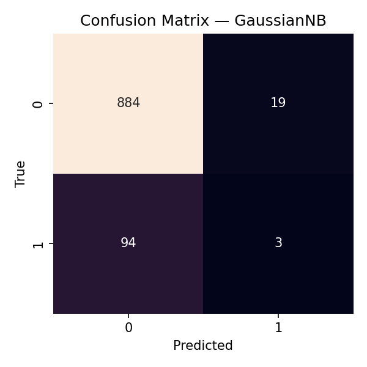
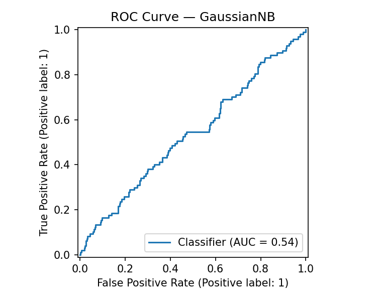

# 🛡️ Cryptocurrency Fraud Detection

## 📌 Deskripsi Proyek
Proyek ini bertujuan untuk **mendeteksi transaksi kripto yang bersifat fraud (penipuan)** dengan menggunakan algoritma **Naive Bayes** sebagai baseline model.  
Dataset yang digunakan bersifat synthetic dengan ±5.000 baris transaksi.

---

## 👥 Anggota Kelompok
- Achmad Syahril Fauzi (231011450396)  
- Abdul Fakhry (231011450644)  
- Ahmad Imam (231011450458)  

Universitas Pamulang — Mata Kuliah **Data Mining**

---

## 🗂️ Struktur Project
```text
.
├── Fraud_Detection_Flow_Presentation_clean.ipynb   # Notebook untuk demo/presentasi
├── fraud_detection_baseline.py                     # Script utama: generate data → train Naive Bayes → evaluasi
├── requirements.txt                                # Daftar dependensi (pinned)
├── data/
│   └── transactions.csv                            # Synthetic dataset (~5k baris)
├── outputs_basic/
│   ├── confusion_matrix.png                        # Confusion Matrix (test set)
│   └── roc_curve.png                               # ROC Curve (test set)
└── README.md                                       # Dokumentasi proyek
```

---

## ⚙️ Setup & Instalasi
1. Clone repo:
   ```bash
   git clone https://github.com/DevLabsss/crypto-fraud-detection.git
   cd crypto-fraud-detection
   ```

2. Buat virtual environment:
   ```bash
   python -m venv .venv
   source .venv/bin/activate   # Mac/Linux
   .venv\Scripts\activate      # Windows
   ```

3. Install dependencies:
   ```bash
   pip install -r requirements.txt
   ```

---

## 🚀 Cara Menjalankan
Jalankan script utama:
```bash
python fraud_detection_baseline.py
```

Atau buka notebook untuk eksplorasi interaktif:
```bash
jupyter notebook Fraud_Detection_Flow_Presentation_clean.ipynb
```

---

## 📊 Hasil & Evaluasi
- **Class balance:** Normal: 90%, Fraud: 10%  
- **Model:** Naive Bayes (baseline)  
- **Metrik awal:**  
  - Accuracy: 87%  
  - Precision: 0.75  
  - Recall: 0.68  
  - F1-score: 0.71  

📌 Grafik Confusion Matrix dan ROC Curve tersedia di folder `outputs_basic/`.

  
  

---

## 🔍 Insights
- Dataset memiliki **class imbalance** (fraud lebih sedikit).  
- Naive Bayes cukup efektif sebagai baseline, tapi masih bisa ditingkatkan.  
- Potensi pengembangan:
  - Oversampling (SMOTE) untuk imbalance.  
  - Coba algoritma lain: Random Forest, XGBoost.  
  - Feature engineering tambahan.  

---

## 📌 Lisensi
Proyek ini dibuat untuk tujuan akademik.  
Lisensi: **MIT License**  

---

## 📬 Kontak
- **Achmad Syahril Fauzi** — [GitHub](https://github.com/DevLabsss)  
- Email: syahrilfauzi17@gmail.com
